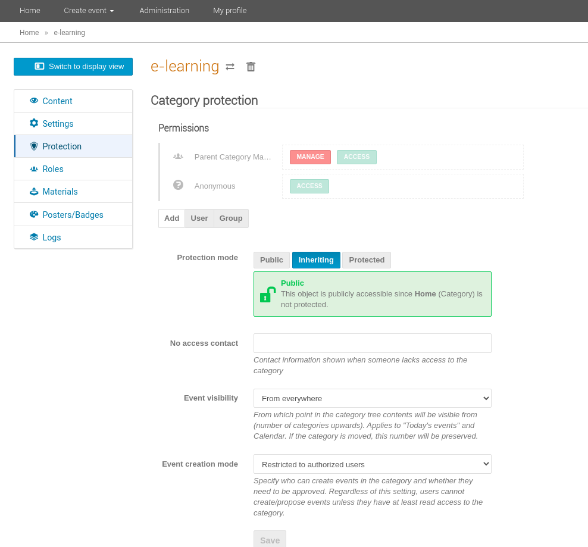

# Managing a Category

You can move sub-categories or events by selecting them using the checkboxes and clicking on the horizontal arrows on your right. You are then prompted to choose the new location of the events/sub-categories.

To delete a sub-category and anything it contains or an event, select it and click on the bin. Categories cannot be deleted if they are not empty.

### Protection

From the Management Area you can protect your category in terms of who can view it, who is its manager and who can create events in the category.

Users and groups can be added to a category to allow access to the Management Area for modification. Category managers are those listed with the *Manage* permission, Indico administrators, and the category creator.

To edit a user or group's permissions click on the pencil. The available permissions allow:

- *Access*: viewing events belonging to the category;
- *Manage*: accessing the management area, modifying all settings and moderating event move requests.
- *Event creation*: creating events in the category;
- *Request event move*: requesting an event to be moved to the category.

Moreover, the *Manage* permission grants the *Event creation* and *Request event move* permissions to the user/group.

*Protection mode*: a category can be:

- *Public*: anyone can view events in it, or
- *Inheriting*: the protection mode of the parent category (see breadcrumbs under the page top banner) applies, or
- *Protected*: only users in the *Permissions* list or administrators can access the category.

When a Category has _Inheriting_ or _Protected_ mode, the manager(s) can define contact information to be shown to non-authorised viewers, so users with no access will know who to contact in order to request access.

Important note for the _Inheriting_ protection mode - changing the parent's protection will change the protection of its sub-categories.

*Event visibility*: this is **not** related to category viewing rights - those are regulated by the *Protection mode* explained above.  The choice offered, allows you to decide whether events in this category will be shown in *Today's events* and the *Calendar* from everywhere or from some parent categories only.

*Event creation mode*: you can restrict who is able to add events to the category. If you do so, you will need to add users or groups to the permissions list in order to allow them to create events, or to moderate event move requests.
